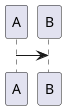

# MarkSpace Markdown format

MarkSpace notes are Markdown with a small set of vault-specific extensions.
On disk the source is plain text; the live editor (BlockNote) round-trips through
these conventions. Agents that create or edit `.md` files **must** follow this
guide. Call `read_format_guide` for the full text when unsure.

<!-- core-rules:start -->
- Prefer wiki-links for notes: `[[Note]]` or `[[folder/note|Alias]]`. Do not use `[[Note#heading]]` (unsupported).
- Embed Draw.io only as `![[path/diagram.drawio]]` or `![[path/diagram.drawio|480]]`. Do not use `![[OtherNote]]` for notes.
- Images: `` or Obsidian-style width ``. Put one blank line before and after the image. Never invent `.assets/` paths — use `save_attachment` / `write_asset` first.
- Tables: use GFM pipe tables. Colored cells become HTML `<table>` with `data-background-color` / `data-text-color` on cells; preserve that HTML when editing.
- Spacing: exactly one blank line between paragraphs and between a paragraph and a list/heading/code block. No multiple consecutive blank lines.
- Diagrams in notes: fenced ` ```mermaid ` or ` ```plantuml ` / ` ```puml `. Chat replies may use the same fences (rendered inline).
- Page tags live in YAML front-matter at the very top: `---` / `tags:` with `  - name` items / `---`, then a blank line before the body. Only `tags` is managed by the UI; keep any other front-matter keys intact and never duplicate the block.
- Do **not** emit unsupported syntax (callouts, math, inline `#tags`, `==highlight==`, `%%comments%%`, footnotes, block ids, note embeds). Full list: call `read_format_guide`.
<!-- core-rules:end -->

## Front-matter and page tags

Notes may start with a YAML front-matter block. It is the on-disk home for **page tags**, edited from the tag overlay in the top-right corner of the page (Live and Source).

```md
---
tags:
  - work
  - inbox
  - project/markspace
---

# Note title
```

- The block must be the very first thing in the file: `---` on line 1, `---` closing line, then the body.
- The UI always writes tags as a block list; `tags: [work, inbox]` and `tags: work` are also read correctly.
- Tag names: no leading `#`, trimmed, case preserved, deduplicated case-insensitively. Nesting is just a `/` inside the name (`area/topic`).
- Other keys (e.g. `aliases`) are preserved when tags change; when the last key is removed the whole block is dropped.
- Tags are not part of the body: the live editor loads only the markdown after the closing `---` and reattaches front-matter on save. Do not restate tags as body text.

## Links

| On disk | Meaning |
|---|---|
| `[[Welcome]]` | Wiki-link to note by path/name (opens or creates) |
| `[[projects/ideas\|Ideas]]` | Wiki-link with display alias |
| `[Site](https://example.com)` | External URL (system browser) |
| `[Local](./Welcome.md)` | Relative file link when possible |

Wiki targets must not contain `#` or `|` inside the target segment. Heading anchors like `[[Note#Section]]` are **not** supported.

Internally the editor may temporarily rewrite wiki-links to `[text](wiki:…)` and back; on disk always prefer `[[…]]`.

## Embeds (Draw.io only)

| On disk | Meaning |
|---|---|
| `![[diagram.drawio]]` | Embed a `.drawio` file (default preview width 480) |
| `![[folder/diagram.drawio\|480]]` | Embed with explicit preview width (pixels) |

Only paths ending in `.drawio` are embeds. General note embeds `![[SomeNote]]` are **not** supported.

Legacy HTML `<div data-drawio-src="…">` may still round-trip to `![[…]]`; prefer the wiki embed form when writing new content.

## Images and assets

- Relative images live under a sibling `.assets/` folder next to the note (or as returned by `save_attachment` / `write_asset`).
- Plain: ``
- Width (Obsidian-style): `` or ``
- `` — only the width is kept; height is ignored
- Captioned images may persist as HTML `<figure>…</figure>`; preserve width when editing
- Always one blank line before and after an image block

## Tables

- Uncolored tables: GFM pipe tables

```md
| A | B |
|---|---|
| 1 | 2 |
```

- When any cell has a non-default background or text color, the note stores a full HTML `<table>` with `data-background-color` and/or `data-text-color` on cells. Do not convert those back to GFM pipes or you will lose colors.

## Diagrams

Fenced code blocks in notes (and in chat replies):

````md



````

Language tags: `mermaid`, `plantuml`, or `puml`. Prefer these for sketches in chat; use Draw.io tools only for `.drawio` vault files.

## Standard blocks

Supported via the editor (typical on-disk forms):

| Feature | Syntax |
|---|---|
| Headings | `#` … `######` |
| Paragraphs | blank-line separated |
| Bold / italic / strike / inline code | `**` `*` `~~` `` ` `` |
| Blockquote | `> …` |
| Bullet / numbered lists | `- ` / `1. ` |
| Task lists | `- [ ]` / `- [x]` |
| Toggle lists | HTML `<details>` / `<summary>` (structure may flatten on export) |
| Code blocks | `` ```lang `` |
| Divider | `---` |
| Images / links / tables | as above |

Slash menu hides video/audio/file blocks; do not invent those block types in markdown.

## Round-trip caveats

- **Underline and text/background colors** applied in the live UI are stripped on Markdown export — they are not a durable on-disk format (except table cell colors via HTML tables).
- **CRLF** is normalized to LF on load; trailing `\` hard-breaks inside fenced code that came from CRLF corruption are healed. Prefer LF and do not add stray `\` at ends of fence lines.
- Wiki-links and Draw.io embeds are rewritten through intermediate forms in the editor; always write the on-disk forms documented here when using `edit_note` / `write_note`.

## Not supported

Do **not** generate any of the following — the editor will treat them as plain text or corrupt the note:

- TOML front-matter (`+++` blocks) — only YAML `---` front-matter is read, and only `tags` is managed
- Callouts / admonitions (`> [!note]`, `::: tip`, etc.)
- Math (`$…$`, `$$…$$`, KaTeX/MathJax)
- Inline hashtags as metadata (`#tag` in note body — use front-matter `tags` instead)
- `==highlight==` syntax
- Comments (`%%…%%`)
- Footnotes (`[^1]`)
- Block IDs (`^block-id`)
- Wiki heading anchors (`[[Note#heading]]`)
- Note embeds (`![[OtherNote]]` — only `.drawio` embeds work)
- MDX / custom directives
