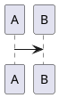
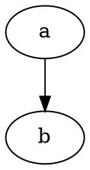
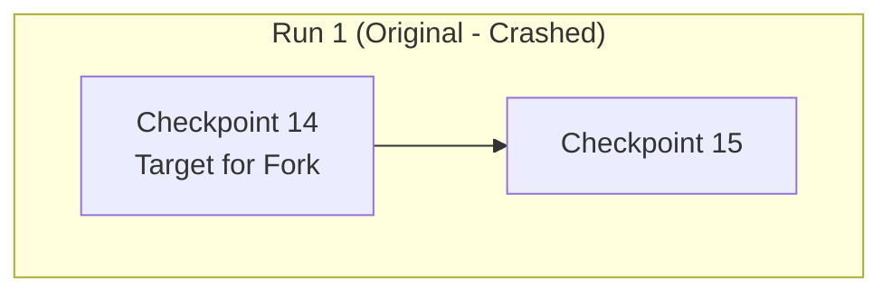

# MarkSpace Markdown format

MarkSpace notes are Markdown with a small set of vault-specific extensions.
On disk the source is plain text; the live editor (BlockNote) round-trips through
these conventions. Agents that create or edit `.md` files **must** follow this
guide. Call `read_format_guide` for the full text when unsure.

<!-- core-rules:start -->
- Prefer wiki-links for notes: `[[Note]]` or `[[folder/note|Alias]]`. Do not use `[[Note#heading]]` (unsupported). A wiki target that names an existing **folder** resolves to that folder’s hidden overview note `{folder}/.folder.md` (created on open if missing). Never write `[label](https://Note.md)` or a bare `https://file.md` for a vault note — that is an external URL, not a wiki-link.
- In **chat replies**, reference vault files with `[[vault/path/Note.md]]`, `[[Note|Label]]`, or `![[vault/path/Note.md]]` — also `.mddict`, `.mdlnks`, `.mdhabit`, `.drawio`, and `.pdf` paths. All render as a clickable file link that opens the document. Mention a file this way whenever you create, open, or cite one.
- Embed Draw.io only as `![[path/diagram.drawio]]` or `![[path/diagram.drawio|480]]`. Embed audio as `![[clip.wav]]` or `![[folder/clip.mp3]]` (also `.m4a` / `.ogg` / `.aac`; a bare filename is next to the note). Outside the chat-only `.md` reference above, do not use `![[OtherNote]]` for notes.
- Images: `` or Obsidian-style width ``. Put one blank line before and after the image. Never invent `.assets/` paths — use `save_attachment` / `write_asset` / `read_file` (with `save_as`) / `clip_article` first.
- Tables: use GFM pipe tables (`| col |`). Never draw ASCII / box-drawing tables (`+---`, `│`, monospace grids) and never put a table inside a plain-text / untitled code fence — those stay unrendered junk. Colored cells become HTML `<table>` with `data-background-color` / `data-text-color` on cells; preserve that HTML when editing.
- Spacing: exactly one blank line between paragraphs and between a paragraph and a list/heading/code block. No multiple consecutive blank lines.
- Blockquotes: each line is `>` then **exactly one** space then the text (`> **Goal:** …`). Never `>  ` (two spaces after `>`) — CommonMark treats the extra space as content, so Live shows the quote shifted right of the bar. Blank quoted lines are a lone `>`. Nested quotes use `> > ` (one space after each `>`). Quoted lists: `> * item`, not `>  * item`.
- Nested lists: use `*` bullets (preferred over `-`). Indent is **relative to the parent item’s text column and compounds at every depth**: take the parent’s own indent and add **2 spaces** for a `*` parent, **3 spaces** for a `1. ` parent (`10. ` → 4). So a bullet under `1. ` sits at 3, its own child at 5, a numbered child of that at 8 — never reset to 2/3 just because you are deeper. Never put a blank line between a parent item and its nested children — that breaks nesting. Bold labels (`* **Label:** …`): put a **short** body on the same line; for a longer explanation after the label, put it in an **indented** continuation paragraph at that item’s text column so it stays inside the item — never a flush-left (or under-indented) paragraph, which ends the list and restarts numbering at `1.`. The same indent applies to anything else inside an item: extra paragraphs, code fences, tables, images. When editing, preserve the note’s existing list markers and indent depth.
- Diagrams: never ASCII / box-drawing flowcharts in plain-text fences. Prefer fenced ` ```d2 ` for richer architecture text-diagrams; also ` ```mermaid `, ` ```plantuml ` / ` ```puml `, ` ```dot ` / ` ```graphviz `, ` ```markmap `. For freeform rich graphics create/edit a `.drawio` and embed `![[path/diagram.drawio]]`. In Mermaid, quote subgraph/node labels that contain `(…)`, `<br/>`, or other special chars: `subgraph id ["Title (detail)"]`, `A["Label<br/>line2"]` — unquoted parentheses inside `[…]` cause parse errors.
- Math: inline `$Cl^-$` and display `$$E = mc^2$$` (KaTeX). Same in chat replies. Prefer TeX for formulas; do not invent unsupported callouts/highlights.
- Page metadata lives in YAML front-matter at the very top. MarkSpace manages `created` and `updated` ISO timestamps on save plus `tags:`, written as a block list of plain strings (`  - work`) — never `  - name: work` or any other mapping; keep any other keys intact and never duplicate the block.
- Diary daily notes may set YAML `marker:` to a catalog id from Settings → Diary (defaults include `holiday`, `important`, `sad`, …) so the sidebar calendar shows that day's emoji; omit the key (or leave it empty) to clear.
- Language-learning projects may keep a **Lexicon** tree at `{project}/Lexicon/…` (at most two folders under `Lexicon/`, then a lemma `.md`). Quick Translate writes a full dictionary article in the background (status bar); keep YAML `lemma` / `lang` / `aliases` and the `## Notes` heading. Do not delete `## Notes` or the user’s text below it. After several **new** lemmas, the app may review and move files inside `Lexicon/`.
- Inline tags in the body: `#multi-agent`, `#project/markspace` (letters, digits, `_`, `-`, `/`). Pure digits (`#5`, `#42`) are not tags. Not ATX headings (`# Title`), not inside code/fences/URLs. Inline tags do **not** auto-write front-matter; both feed the vault tag catalog.
- Do **not** emit unsupported syntax (callouts, `==highlight==`, `%%comments%%`, footnotes, block ids, note embeds in note bodies). Full list: call `read_format_guide`.
<!-- core-rules:end -->

## Front-matter, timestamps, and page tags

Notes may start with a YAML front-matter block. It stores lifecycle timestamps and **page tags**, which are edited from the tag overlay in the top-right corner of the page (Live and Source).

```md
---
created: 2026-08-01T10:03:00.000Z
updated: 2026-08-01T10:15:42.000Z
tags:
  - work
  - inbox
  - project/markspace
marker: holiday
---

# Note title
```

- The block must be the very first thing in the file: `---` on line 1, `---` closing line, then the body.
- `created` is set when MarkSpace creates the note (or on the first MarkSpace save of an existing note) and is then preserved. `updated` is refreshed on every save. Both use UTC ISO 8601 timestamps.
- The UI always writes tags as a block list of plain strings; `tags: [work, inbox]` and `tags: work` are also read correctly.
- Each item must be a scalar. Mapping items (`  - name: work`) are a mistake: they are tolerated on read (the `name` / `tag` value is used) but rewritten as plain strings on the next tag edit.
- Tag names: no leading `#`, trimmed, case preserved, deduplicated case-insensitively. Nesting is just a `/` inside the name (`area/topic`).
- Diary **daily notes** may include `marker:` — a single catalog id, not a free emoji. The catalog lives in this vault at `.markspace/diary.json` and is edited in Settings → Diary. Built-in defaults: `important` (⭐), `holiday` (🎉), `birthday` (🎂), `travel` (✈️), `work` (💼), `happy` (😊), `sad` (😢), `grief` (🖤), `love` (❤️), `deadline` (⚠️), `health` (🏥), `rest` (😴). Ids that are not in the catalog are ignored in the calendar (treated as unset) but kept in YAML until changed. Right-click a day in the sidebar calendar, or use the marker control next to page tags, to set or clear it. Clearing removes the key.
- Other keys (e.g. `aliases`) are preserved when tags change; when the last key is removed the whole block is dropped.
- Front-matter tags are edited from the tag overlay; the live editor loads only the markdown after the closing `---` and reattaches front-matter on save.
- You may also use **inline tags** in the body (below); they are separate from front-matter and are not copied into `tags:` automatically.

## Language-learning lexicon

Foreign-language **projects** (top-level folders with project type language learning) may contain `{project}/Lexicon/`. Quick Translate (Ctrl+Shift+T) caches a compact JSON card, then **in the background** (status bar) writes a full dictionary article into the lemma note. After every **8 new lemmas** in that project (any entry point that creates a lemma note), a separate background job may **move** files under `Lexicon/` (at most two category folders, then the `.md` file). Regenerating an existing article does not count. Do not open the note just to generate it.

The generated article is a **study note** in MarkSpace markdown (not lookup JSON): GFM tables, nested `*` lists, `[[project/Lexicon/lemma|lemma]]` wiki-links, one blank line between blocks. Typical sections: Pronunciation, Grammar, Meanings, Collocations, Idioms, Related words, Usage, Common mistakes. Omit empty sections. Explanations in the user’s native language; examples in the learning language. Do not invent `.assets/` or Draw.io paths.

```md
---
created: 2026-08-22T10:00:00.000Z
updated: 2026-08-22T10:00:00.000Z
lemma: register
lang: en
aliases:
  - registered
---

# register

* **Verb / noun** — зарегистрироваться; реестр; речевой регистр.

## Grammar

| Form | Example |
| --- | --- |
| register / registered / registered | I registered yesterday. |

* **Pattern:** register **for** a course (not *in*).

## Meanings

* **Verb — записаться** (Neutral)
  * You must [[English/Lexicon/enroll|enroll]] vs *register* for official lists.
  * Please register for the exam online.
    * Запишитесь на экзамен онлайн.

## Collocations

| Chunk | Meaning |
| --- | --- |
| register a complaint | подать жалобу |

## Notes

Your comments stay below this heading. The generated block above may be refreshed; this tail is not overwritten.
```

- Keep `lemma`, `lang`, and `aliases` in front-matter (plus `created` / `updated` / `tags` as usual).
- Always keep a `## Notes` heading. Put personal examples and comments **below** it. Do not parse or replace that tail when editing the generated card.
- Do not store model JSON in the note body.
- Agents may move notes inside that project’s `Lexicon/` only; do not nest deeper than `Lexicon/{a}/{b}/{lemma}.md`.

## Inline tags

In the note body, hashtags are styled inline tags (editable text in Live mode):

| On disk | Meaning |
|---|---|
| `#multi-agent` | Inline tag `multi-agent` |
| `#project/markspace` | Nested-style name (`/` inside the tag) |

- Valid name after `#`: Unicode letters/digits, then letters/digits/`_`/`-`/`/`. Pure digit names (`#5`, `#42`) are **not** tags.
- Must be bounded (start of text or after whitespace/punctuation). `word#tag` is not a tag.
- Not tags: ATX headings (`# Title`, `## H2`), content inside inline/fenced code, URL fragments (`https://ex.com/a#frag`). Heading-style wiki anchors (`[[Note#heading]]`) are unsupported as jumps (the `#…` is part of the path).
- Trailing punctuation (`.`, `,`, `!`, `)`) stays outside the tag: `#work.` → tag `work` + `.`.
- Inline tags remain ordinary markdown text — you can place the caret inside and edit them. Live mode only highlights matching `#tags`.
- Inline tags and front-matter `tags` share one vault catalog for suggestions; writing `#work` does **not** add `work` to YAML front-matter.

## Links

| On disk | Meaning |
|---|---|
| `[[Welcome]]` | Wiki-link to note by path/name (opens or creates) |
| `[[projects]]` | Wiki-link to a **folder** → hidden overview `{folder}/.folder.md` |
| `[[projects/ideas\|Ideas]]` | Wiki-link with display alias |
| `[Site](https://example.com)` | External URL (system browser) |

Internal links are **only** `[[…]]`. Do not use Markdown file hrefs (`[Local](./Welcome.md)`, `[Note](Note.md)`) or fake hosts (`[20.08.2010.md](https://20.08.2010.md)`). `http:` / `https:` / `mailto:` always open in the system browser.

Wiki targets must not contain `|` inside the target segment. A literal `#` in a path (e.g. folder `#5 …`) is allowed. Heading anchors like `[[Note#Section]]` are **not** supported — the `#…` part is treated as part of the path, not a jump to a heading.

Each vault folder may have a hidden **folder note** at `{folder}/.folder.md` (not shown in the sidebar tree). Clicking the folder creates it if missing and opens it. A wiki target that matches an existing folder resolves to that path; the note is created on open when absent.

Internally the editor may temporarily rewrite wiki-links to `[text](wiki:…)` and back; on disk always prefer `[[…]]`.

### Note references in chat replies

Chat replies render wiki-links as clickable note references — a file icon plus
link text. Clicking opens the note or activates its existing editor tab.

| In a chat reply | Result |
|---|---|
| `[[vault/path/Note.md]]` | Link labelled with the path |
| `[[vault/path/Note]]` | Same; the target is resolved without the extension |
| `[[vault/path/Note\|Display label]]` | Link labelled `Display label` |
| `![[vault/path/Note.md]]` | Same as the plain `[[…]]` form (not an embed) |
| `[[vault/path/Dict.mddict\|Dictionary]]` | Opens a `.mddict` dictionary |
| `[[vault/path/Links.mdlnks]]` | Opens a `.mdlnks` links collection |
| `[[vault/path/Habits.mdhabit]]` | Opens a `.mdhabit` yearly habit tracker |

Use this whenever you create, open, or cite a note, so the user can jump to it.
Targets are vault-relative and must not contain `|` in the path segment. A literal `#` in a folder or file name is allowed.

## Embeds (Draw.io and audio)

| On disk | Meaning |
|---|---|
| `![[diagram.drawio]]` | Embed a `.drawio` file (default preview width 480) |
| `![[folder/diagram.drawio\|480]]` | Embed with explicit preview width (pixels) |
| `![[listening.wav]]` | Embed an audio player (file next to the note, or vault-relative if the path has `/`) |
| `![[folder/clip.mp3]]` | Same for `.mp3` / `.m4a` / `.ogg` / `.aac` |

Only paths ending in `.drawio` or those audio extensions are embeds. General note embeds `![[SomeNote]]` are **not** supported.

Legacy HTML `<div data-drawio-src="…">` may still round-trip to `![[…]]`; prefer the wiki embed form when writing new content.

## Images and assets

- Relative images often live under a sibling `.assets/` folder next to the note (or as returned by `save_attachment` / `write_asset`).
- You may also save with `read_file` + `save_as` to any vault-relative path the user requests; use the returned `saved_path` in markdown (relative to the note when possible).
- Plain: ``
- Width (Obsidian-style): `` or ``
- `` — only the width is kept; height is ignored
- Captioned images may persist as HTML `<figure>…</figure>`; preserve width when editing
- Always one blank line before and after an image block

## Tables

- Uncolored tables: **GFM pipe tables** only (rendered in Live and in chat).

```md
| A | B |
|---|---|
| 1 | 2 |
```

- Do **not** draw tables with ASCII / box-drawing characters (`+---+`, `│`, spaced columns in a monospace block) and do **not** wrap a table in a plain / untitled fenced code block — it will show as a “Plain Text” code card instead of a table.
- When any cell has a non-default background or text color, the note stores a full HTML `<table>` with `data-background-color` and/or `data-text-color` on cells. Do not convert those back to GFM pipes or you will lose colors.

## Diagrams

Fenced code blocks in notes (and in chat replies):

````md




```d2
direction: down
a -> b
```



```markmap
# Topic
## Branch
```
````

Language tags: `mermaid`, `plantuml` / `puml`, `d2`, `dot` / `graphviz` (saved as `dot`), `markmap`.

- **D2** — preferred for richer architecture / cascade text-diagrams (containers, themes, layout).
- Mermaid / PlantUML — quick flowcharts, sequences, sketches.
- **DOT / Graphviz** — dense branching graphs.
- **Markmap** — mind maps from a Markdown outline.
- For **freeform** rich graphics (colors, swimlanes, ArchiMate, hand layout) use a vault **Draw.io** file (`.drawio`) via diagram tools, then embed `![[path/diagram.drawio]]` (optional width `|480`).
- Do **not** draw diagrams with ASCII / box-drawing characters in a plain / untitled code fence — same problem as ASCII tables: they stay a “Plain Text” card.

### Mermaid pitfalls (common parse errors)

Mermaid treats `(…)`, `[…]`, `{…}` inside labels as **shape syntax**. Titles or node text with parentheses, colons, commas, or `<br>` must be **double-quoted**:

````md

````

- Wrong: `subgraph Run_1 [Run 1 (Original - Crashed)]` — the `(` after the title breaks parsing (`Expecting 'SQE' … got 'PS'`).
- Right: `subgraph Run_1 ["Run 1 (Original - Crashed)"]`.
- Same for nodes: `A["Label (detail)"]`, not `A[Label (detail)]`.
- Prefer `flowchart` over legacy `graph`; use `<br/>` inside quoted labels for line breaks.
- `classDef` / `style`: do not put spaces inside CSS values — `stroke-dasharray:5 5` is ok, but a broken `classDef` often creates a stray node labeled `class`. Prefer `A:::failed` over a trailing `class A failed` line when possible.
- **Sequence diagrams:** MarkSpace enables message/note wrapping (`sequence.wrap`) with equal actor columns (`actorMargin` + fixed `width`) so long payloads wrap vertically instead of stretching lifelines unevenly. Prefer plain message text without `<br/>` — a single `<br/>` disables Mermaid’s auto-wrap for that label. Explicit breaks are stripped at render time when wrap is on.

## Standard blocks

Supported via the editor (typical on-disk forms):

| Feature | Syntax |
|---|---|
| Headings | `#` … `######` |
| Paragraphs | blank-line separated |
| Bold / italic / strike / inline code | `**` `*` `~~` `` ` `` |
| Blockquote | `> …` — one space after `>` (see below) |
| Bullet / numbered lists | `* ` (preferred) or `- ` / `1. ` — see Lists |
| Task lists | `- [ ]` / `- [x]` |
| Toggle lists | HTML `<details>` / `<summary>` (structure may flatten on export) |
| Code blocks | `` ```lang `` |
| Divider | `---` |
| Images / links / tables | as above |
| Math | `$inline$` / `$$display$$` (KaTeX) |

Slash menu hides video/audio/file blocks; do not invent those block types in markdown.

### Blockquotes

Write `>` plus **one** space, then the line. That space is the quote marker, not padding.

```md
> **Goal:** Band 7.0 – 7.5 (General Training)
> **Level:** B2
>
> * Nested bullet inside the quote.
```

Wrong — two (or more) spaces after `>` put a leading space in the quoted paragraph; Live then sits the text a character to the right of the bar:

```md
>  **Goal:** Band 7.0
```

- Every continued line of the same quote still starts with `> `.
- A blank line inside the quote is `>` with nothing after it.
- Nested quote: `> > inner`.
- Do not indent quoted lines with extra spaces beyond that single marker space.

## Lists

Prefer `*` for unordered lists (CommonMark treats `*` and `-` the same; MarkSpace notes conventionally use `*`). Numbered lists use `1. `, `2. `, …

**Nesting (critical for `edit_note` / `write_note`):**

Indentation is **relative to the parent item, not to the left margin**, so it grows with depth. Every item has a *text column* = its own indent + the width of its marker (`* ` → +2, `1. ` → +3, `10. ` → +4). Anything belonging to that item — nested lists, continuation paragraphs, code fences, tables, images — starts at that column:

| Item | Its indent | Text column = indent for its children / continuations |
|---|---|---|
| `* item` | 0 | 2 spaces (`  * nested`) |
| `1. item` | 0 | 3 spaces (`   * nested`) |
| `   * item` (child of `1.`) | 3 | 5 spaces |
| `     1. item` (child of that) | 5 | 8 spaces |

- Do **not** insert a blank line between a parent and its nested children — parsers treat that as ending the list / flattening hierarchy.
- **Bold labels in bullets:**
  - Short body → same line: `* **Label:** short explanation.`
  - Longer body after the label → blank line, then a continuation paragraph indented to the item’s text column so the text stays in the list item.
  - Never put a flush-left (or under-indented) paragraph under the label — Markdown treats that as outside the list, and in a numbered list each following item then restarts at `1.`.
- A blank line **after the whole list** is correct before a following top-level paragraph.
- Do not mix 4-space / tab indents for nesting; derive the indent from the parent’s text column as above.
- When editing an existing note, keep its markers (`*` vs `-`) and indent depths; do not “normalize” nested lists into flat ones.
- On note read/write, MarkSpace may auto-indent a flush (or under-indented) continuation paragraph that sits between two same-level list siblings — that is the case that otherwise exits the list and restarts numbering at `1.`. It never decreases indent, never rewrites markers, and leaves regions alone if a code fence or ATX heading sits between the siblings.
- The Live editor writes this layout itself: indenting a block with **Tab** puts it inside the item above, and saving emits it at that item’s text column (paragraphs, code fences, tables, images alike). Tab does nothing when the block above is not a list item, because Markdown has no way to store that indent.

```md
* **Short topic:** body stays on the same line.
* **Longer topic:**

  Indented paragraph — still part of this bullet, not a top-level block.
  * Nested detail under the topic.
  * Another nested detail.

1. First numbered step with nested bullets under it:
   * Condition A.
   * Condition B.
2. Second numbered step (sibling of 1, not nested).

* **Multi-paragraph item:** first paragraph on this line.

  Indented second paragraph still belongs to this bullet.
```

Deeper nesting — each level keeps adding to the parent’s text column:

```md
1. **Isolate the work:**

   Continuation of step 1, indented 3 spaces.

   * Nested bullet at 3 spaces.

     Its own continuation at 5 spaces (3 + 2).

     1. Numbered child at 5 spaces.

        Continuation of that child at 8 spaces (5 + 3).
2. **Second step:** numbering keeps counting because every body stayed indented.
```

Wrong (body drops out of the list, numbering restarts at `1.`):

```md
1. **Topic label:**

Flush-left paragraph — looks nested, but Markdown treats it as outside the list.

1. **Next topic:** renders as “1.” again instead of “2.”.
```

## Math

Inline and display TeX, rendered with KaTeX in Live and in chat:

```md
Ethanol opens GABA-A channels; more $Cl^-$ enters the neuron.

$$
E = mc^2
$$
```

- Inline: `$…$` — no space right after the opening `$` or before the closing `$`; single line.
- Display: prefer blank-line-wrapped

  ```md
  $$
  E = mc^2
  $$
  ```

  One-line `$$E = mc^2$$` is also accepted (chat expands it to display; Live projects it to a block equation).
- Skipped inside fenced/inline code. A lone `$5` (no closing `$`) stays plain text.
- Comparisons with `<` / `>` are fine: `$<5$`, `$a < b$`, `$x>0$` (Live projects them to KaTeX; prefer `\lt` / `\gt` only if you want to avoid raw `<` in TeX source).
- Inside `\text{…}`, escape underscores: `\text{base\_delay}` (plain `\text{base_delay}` is a KaTeX error).
- Live also inserts via slash menu **Block equation** / **Inline equation**.
## Round-trip caveats

- **Underline and text/background colors** applied in the live UI are stripped on Markdown export — they are not a durable on-disk format (except table cell colors via HTML tables).
- **CRLF** is normalized to LF on load; trailing `\` hard-breaks inside fenced code that came from CRLF corruption are healed. Prefer LF and do not add stray `\` at ends of fence lines.
- Wiki-links and Draw.io embeds are rewritten through intermediate forms in the editor; always write the on-disk forms documented here when using `edit_note` / `write_note`.
- Math round-trips through inline `data-latex` spans and temporary equation HTML (`data-content-type="equation"`) in the Live editor; on disk always use `$` / `$$`.

## Not supported

Do **not** generate any of the following — the editor will treat them as plain text or corrupt the note:

- TOML front-matter (`+++` blocks) — only YAML `---` front-matter is read, and only `tags` is managed
- Callouts / admonitions (`> [!note]`, `::: tip`, etc.)
- `==highlight==` syntax
- Comments (`%%…%%`)
- Footnotes (`[^1]`)
- Block IDs (`^block-id`)
- Wiki heading anchors (`[[Note#heading]]`)
- Note embeds in note bodies (`![[OtherNote]]` — only `.drawio` and audio `.wav`/`.mp3`/`.m4a`/`.ogg`/`.aac` embeds work). Chat replies may use `![[path/Note.md]]` as a clickable note reference (see above); that is not an embed.
- MDX / custom directives
