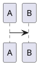

# MarkSpace Markdown format

MarkSpace notes are Markdown with a small set of vault-specific extensions.
On disk the source is plain text; the live editor (BlockNote) round-trips through
these conventions. Agents that create or edit `.md` files **must** follow this
guide. Call `read_format_guide` for the full text when unsure.

<!-- core-rules:start -->
- Prefer wiki-links for notes: `[[Note]]` or `[[folder/note|Alias]]`. Do not use `[[Note#heading]]` (unsupported). A wiki target that names an existing **folder** resolves to that folder’s hidden overview note `{folder}/.folder.md` (created on open if missing).
- In **chat replies**, reference vault notes with `[[vault/path/Note.md]]`, `[[Note|Label]]`, or `![[vault/path/Note.md]]` — all render as a clickable file link that opens the note. Mention a note this way whenever you create, open, or cite one.
- Embed Draw.io only as `![[path/diagram.drawio]]` or `![[path/diagram.drawio|480]]`. Outside the chat-only `.md` reference above, do not use `![[OtherNote]]` for notes.
- Images: `` or Obsidian-style width ``. Put one blank line before and after the image. Never invent `.assets/` paths — use `save_attachment` / `write_asset` / `read_file` (with `save_as`) / `clip_article` first.
- Tables: use GFM pipe tables. Colored cells become HTML `<table>` with `data-background-color` / `data-text-color` on cells; preserve that HTML when editing.
- Spacing: exactly one blank line between paragraphs and between a paragraph and a list/heading/code block. No multiple consecutive blank lines.
- Nested lists: use `*` bullets (preferred over `-`). Indent children with **2 spaces** under a `*` parent (`  * child`) and **3 spaces** under a numbered item (`   * child`). Never put a blank line between a parent item and its nested children — that breaks nesting. A blank line is only for a list item followed by a paragraph. When editing, preserve the note’s existing list markers and indent depth.
- Diagrams in notes: fenced ` ```mermaid ` or ` ```plantuml ` / ` ```puml `. Chat replies may use the same fences (rendered inline).
- Math: inline `$Cl^-$` and display `$$E = mc^2$$` (KaTeX). Same in chat replies. Prefer TeX for formulas; do not invent unsupported callouts/highlights.
- Page metadata lives in YAML front-matter at the very top. MarkSpace manages `created` and `updated` ISO timestamps on save plus `tags:`, written as a block list of plain strings (`  - work`) — never `  - name: work` or any other mapping; keep any other keys intact and never duplicate the block.
- Inline tags in the body: `#multi-agent`, `#project/markspace` (letters, digits, `_`, `-`, `/`). Pure digits (`#5`, `#42`) are not tags. Not ATX headings (`# Title`), not inside code/fences/URLs. Inline tags do **not** auto-write front-matter; both feed the vault tag catalog.
- Do **not** emit unsupported syntax (callouts, `==highlight==`, `%%comments%%`, footnotes, block ids, note embeds in note bodies). Full list: call `read_format_guide`.
<!-- core-rules:end -->

## Front-matter, timestamps, and page tags

Notes may start with a YAML front-matter block. It stores lifecycle timestamps and **page tags**, which are edited from the tag overlay in the top-right corner of the page (Live and Source).

```md
---
created: 2026-08-01T10:03:00.000Z
updated: 2026-08-01T10:15:42.000Z
tags:
  - work
  - inbox
  - project/markspace
---

# Note title
```

- The block must be the very first thing in the file: `---` on line 1, `---` closing line, then the body.
- `created` is set when MarkSpace creates the note (or on the first MarkSpace save of an existing note) and is then preserved. `updated` is refreshed on every save. Both use UTC ISO 8601 timestamps.
- The UI always writes tags as a block list of plain strings; `tags: [work, inbox]` and `tags: work` are also read correctly.
- Each item must be a scalar. Mapping items (`  - name: work`) are a mistake: they are tolerated on read (the `name` / `tag` value is used) but rewritten as plain strings on the next tag edit.
- Tag names: no leading `#`, trimmed, case preserved, deduplicated case-insensitively. Nesting is just a `/` inside the name (`area/topic`).
- Other keys (e.g. `aliases`) are preserved when tags change; when the last key is removed the whole block is dropped.
- Front-matter tags are edited from the tag overlay; the live editor loads only the markdown after the closing `---` and reattaches front-matter on save.
- You may also use **inline tags** in the body (below); they are separate from front-matter and are not copied into `tags:` automatically.

## Inline tags

In the note body, hashtags are styled inline tags (editable text in Live mode):

| On disk | Meaning |
|---|---|
| `#multi-agent` | Inline tag `multi-agent` |
| `#project/markspace` | Nested-style name (`/` inside the tag) |

- Valid name after `#`: Unicode letters/digits, then letters/digits/`_`/`-`/`/`. Pure digit names (`#5`, `#42`) are **not** tags.
- Must be bounded (start of text or after whitespace/punctuation). `word#tag` is not a tag.
- Not tags: ATX headings (`# Title`, `## H2`), content inside inline/fenced code, URL fragments (`https://ex.com/a#frag`). Heading-style wiki anchors (`[[Note#heading]]`) are unsupported as jumps (the `#…` is part of the path).
- Trailing punctuation (`.`, `,`, `!`, `)`) stays outside the tag: `#work.` → tag `work` + `.`.
- Inline tags remain ordinary markdown text — you can place the caret inside and edit them. Live mode only highlights matching `#tags`.
- Inline tags and front-matter `tags` share one vault catalog for suggestions; writing `#work` does **not** add `work` to YAML front-matter.

## Links

| On disk | Meaning |
|---|---|
| `[[Welcome]]` | Wiki-link to note by path/name (opens or creates) |
| `[[projects]]` | Wiki-link to a **folder** → hidden overview `{folder}/.folder.md` |
| `[[projects/ideas\|Ideas]]` | Wiki-link with display alias |
| `[Site](https://example.com)` | External URL (system browser) |
| `[Local](./Welcome.md)` | Relative file link when possible |

Wiki targets must not contain `|` inside the target segment. A literal `#` in a path (e.g. folder `#5 …`) is allowed. Heading anchors like `[[Note#Section]]` are **not** supported — the `#…` part is treated as part of the path, not a jump to a heading.

Each vault folder may have a hidden **folder note** at `{folder}/.folder.md` (not shown in the sidebar tree). Clicking the folder creates it if missing and opens it. A wiki target that matches an existing folder resolves to that path; the note is created on open when absent.

Internally the editor may temporarily rewrite wiki-links to `[text](wiki:…)` and back; on disk always prefer `[[…]]`.

### Note references in chat replies

Chat replies render wiki-links as clickable note references — a file icon plus
link text. Clicking opens the note or activates its existing editor tab.

| In a chat reply | Result |
|---|---|
| `[[vault/path/Note.md]]` | Link labelled with the path |
| `[[vault/path/Note]]` | Same; the target is resolved without the extension |
| `[[vault/path/Note\|Display label]]` | Link labelled `Display label` |
| `![[vault/path/Note.md]]` | Same as the plain `[[…]]` form (not an embed) |

Use this whenever you create, open, or cite a note, so the user can jump to it.
Targets are vault-relative and must not contain `|` in the path segment. A literal `#` in a folder or file name is allowed.

## Embeds (Draw.io only)

| On disk | Meaning |
|---|---|
| `![[diagram.drawio]]` | Embed a `.drawio` file (default preview width 480) |
| `![[folder/diagram.drawio\|480]]` | Embed with explicit preview width (pixels) |

Only paths ending in `.drawio` are embeds. General note embeds `![[SomeNote]]` are **not** supported.

Legacy HTML `<div data-drawio-src="…">` may still round-trip to `![[…]]`; prefer the wiki embed form when writing new content.

## Images and assets

- Relative images often live under a sibling `.assets/` folder next to the note (or as returned by `save_attachment` / `write_asset`).
- You may also save with `read_file` + `save_as` to any vault-relative path the user requests; use the returned `saved_path` in markdown (relative to the note when possible).
- Plain: ``
- Width (Obsidian-style): `` or ``
- `` — only the width is kept; height is ignored
- Captioned images may persist as HTML `<figure>…</figure>`; preserve width when editing
- Always one blank line before and after an image block

## Tables

- Uncolored tables: GFM pipe tables

```md
| A | B |
|---|---|
| 1 | 2 |
```

- When any cell has a non-default background or text color, the note stores a full HTML `<table>` with `data-background-color` and/or `data-text-color` on cells. Do not convert those back to GFM pipes or you will lose colors.

## Diagrams

Fenced code blocks in notes (and in chat replies):

````md



````

Language tags: `mermaid`, `plantuml`, or `puml`. Prefer these for sketches in chat; use Draw.io tools only for `.drawio` vault files.

## Standard blocks

Supported via the editor (typical on-disk forms):

| Feature | Syntax |
|---|---|
| Headings | `#` … `######` |
| Paragraphs | blank-line separated |
| Bold / italic / strike / inline code | `**` `*` `~~` `` ` `` |
| Blockquote | `> …` |
| Bullet / numbered lists | `* ` (preferred) or `- ` / `1. ` — see Lists |
| Task lists | `- [ ]` / `- [x]` |
| Toggle lists | HTML `<details>` / `<summary>` (structure may flatten on export) |
| Code blocks | `` ```lang `` |
| Divider | `---` |
| Images / links / tables | as above |
| Math | `$inline$` / `$$display$$` (KaTeX) |

Slash menu hides video/audio/file blocks; do not invent those block types in markdown.

## Lists

Prefer `*` for unordered lists (CommonMark treats `*` and `-` the same; MarkSpace notes conventionally use `*`). Numbered lists use `1. `, `2. `, …

**Nesting (critical for `edit_note` / `write_note`):**

| Parent | Child indent | Example |
|---|---|---|
| `* item` | 2 spaces | `  * nested` |
| `1. item` | 3 spaces | `   * nested` |

- Do **not** insert a blank line between a parent and its nested children — parsers treat that as ending the list / flattening hierarchy.
- A blank line **after** a list item is correct when the next block is a paragraph (not a child bullet).
- Do not mix 4-space / tab indents for nesting; stick to the 2-space / 3-space pattern above.
- When editing an existing note, keep its markers (`*` vs `-`) and indent depths; do not “normalize” nested lists into flat ones.

```md
* **Topic label:**
  * Nested detail under the topic.
  * Another nested detail.

1. First numbered step with nested bullets under it:
   * Condition A.
   * Condition B.
2. Second numbered step (sibling of 1, not nested).

* **Next topic:** followed by a paragraph after a blank line.

Paragraph that continues under the previous bullet’s topic — not a nested list item.
```

## Math

Inline and display TeX, rendered with KaTeX in Live and in chat:

```md
Ethanol opens GABA-A channels; more $Cl^-$ enters the neuron.

$$
E = mc^2
$$
```

- Inline: `$…$` — no space right after the opening `$` or before the closing `$`; single line.
- Display: `$$…$$` — may span lines; Live also inserts via slash menu **Block equation** / **Inline equation**.
- Skipped inside fenced/inline code. A lone `$5` (no closing `$`) stays plain text.

## Round-trip caveats

- **Underline and text/background colors** applied in the live UI are stripped on Markdown export — they are not a durable on-disk format (except table cell colors via HTML tables).
- **CRLF** is normalized to LF on load; trailing `\` hard-breaks inside fenced code that came from CRLF corruption are healed. Prefer LF and do not add stray `\` at ends of fence lines.
- Wiki-links and Draw.io embeds are rewritten through intermediate forms in the editor; always write the on-disk forms documented here when using `edit_note` / `write_note`.
- Math round-trips through inline `data-latex` spans and temporary ` ```math ` fences in the Live editor; on disk always use `$` / `$$`.

## Not supported

Do **not** generate any of the following — the editor will treat them as plain text or corrupt the note:

- TOML front-matter (`+++` blocks) — only YAML `---` front-matter is read, and only `tags` is managed
- Callouts / admonitions (`> [!note]`, `::: tip`, etc.)
- `==highlight==` syntax
- Comments (`%%…%%`)
- Footnotes (`[^1]`)
- Block IDs (`^block-id`)
- Wiki heading anchors (`[[Note#heading]]`)
- Note embeds in note bodies (`![[OtherNote]]` — only `.drawio` embeds work). Chat replies may use `![[path/Note.md]]` as a clickable note reference (see above); that is not an embed.
- MDX / custom directives
